<div align="center">


<h1>Data Quality Framework</h1>

<p><strong>The Enterprise Standard for Measuring, Monitoring, and Improving Data Trust at Industrial Scale</strong></p>

[]()
[]()
[]()
[]()

<br/>

> **"Data without quality is just noise; quality without a framework is just luck."** 
> Data Quality Framework is a flagship platform designed to enable organizations to define, monitor, score, and remediate data quality across multi-cloud and hybrid estates.

</div>

---

## 🏛️ Executive Summary

**Data Quality Framework** is a flagship repository designed for Chief Data Officers (CDOs), Data Governance leads, and Engineering teams. In the modern data estate, the "Cost of Poor Quality" (COPQ) can account for 15-25% of total revenue.

This framework provides an industrialized approach to **Data Trust**, delivering production-ready **Rule Engines**, **Quality Workflows**, **Automated Profiling**, and **Executive Scorecards**. It supports **Databricks**, **Snowflake**, **Microsoft Fabric**, and **BigQuery**, enabling teams to transform raw datasets into **Certified Trusted Assets** with measurable SLAs.

---

## 💡 Why Data Quality Matters

Quality is the foundation of the "Data-Value" pyramid:
- **Operational Efficiency**: Reducing the time engineers spend "cleaning" data (often 80% of their time).
- **Informed Decisions**: Ensuring executives make billion-dollar bets on accurate, fresh data.
- **AI/ML Reliability**: Preventing "Garbage In, Garbage Out" in high-stakes AI models.
- **Regulatory Compliance**: Meeting stringent BCBS 239, GDPR, and HIPAA accuracy requirements.

---

## 🚀 Business Outcomes

### 🎯 Strategic Quality Impact
- **Industrialized Trust**: Moving from "Ad-hoc" scripts to a unified, scalable quality engine.
- **Rapid Remediation**: Reducing Mean Time to Resolve (MTTR) for data quality incidents by 70%.
- **Certified Consumption**: Providing business users with "Trust Scores" directly on their dashboards.
- **Automated Governance**: Embedding quality checks into CI/CD pipelines and ingestion workflows.

---

## 🏗️ Technical Stack

| Layer | Technology | Rationale |
|---|---|---|
| **Quality Engine** | Python, Pandas, NumPy | High-performance, flexible rule execution and profiling. |
| **Control Plane** | FastAPI | High-performance API for rules, scoring, and incidents. |
| **Frontend** | React 18, Vite | Premium portal for executive scorecards and rule management. |
| **IaC Foundation** | Terraform | Multi-cloud infrastructure consistency and automation. |
| **Database** | PostgreSQL | Centralized repository for quality rules, scores, and incidents. |
| **Observability** | Prometheus / Grafana | Real-time monitoring of quality check execution and health. |

---

## 📐 Architecture Storytelling: 60+ Diagrams

### 1. Executive High-Level Architecture
The holistic vision of the enterprise data trust lifecycle.

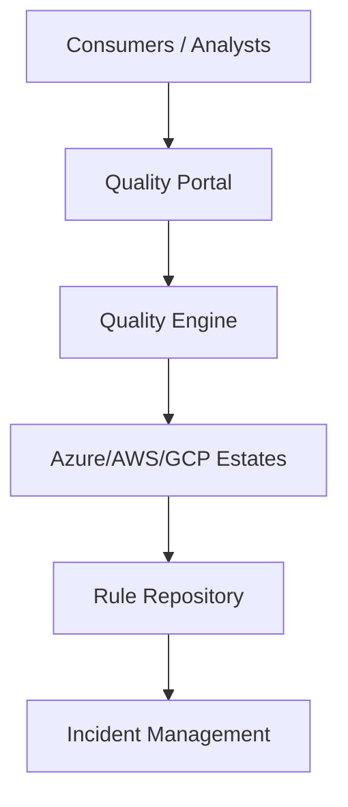

### 2. Detailed Component Topology
The internal service boundaries and management layers of the framework.

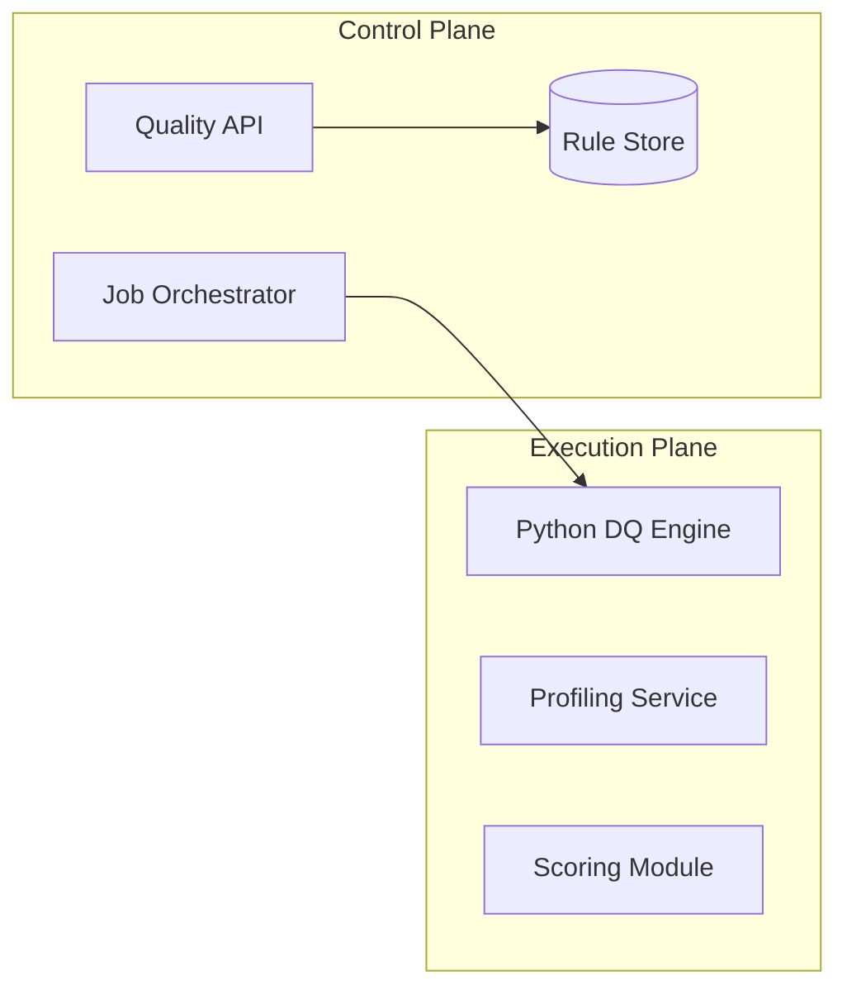

### 3. Frontend to Backend Request Path
Tracing a "Run Quality Check" request through the stack.

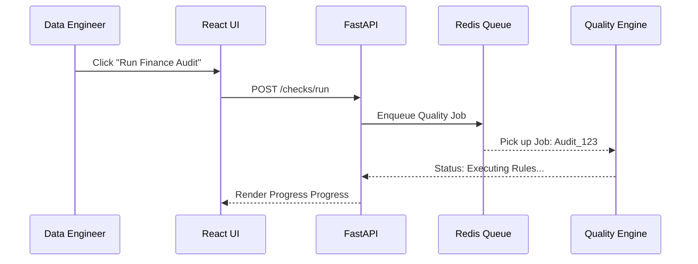

### 4. Metadata + Rules Control Plane
The "Brain" of the framework managing cross-cloud quality definitions.

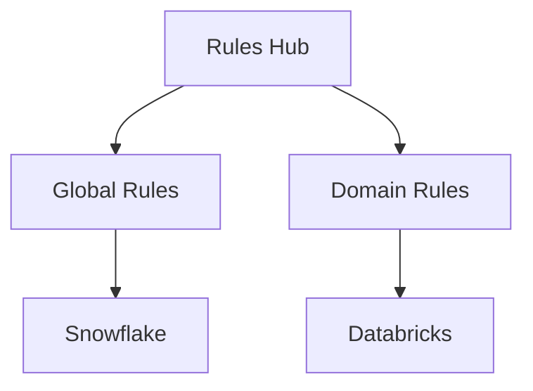

### 5. Multi-Cloud Data Platform Topology
Synchronizing quality standards across diverse storage and compute layers.

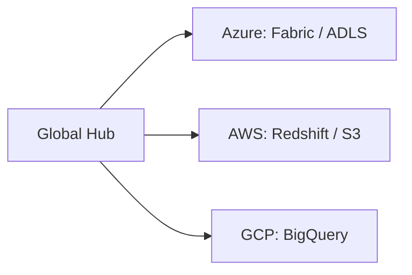

### 6. Regional Deployment Model
Hosting quality engines close to the data for performance and sovereignty.

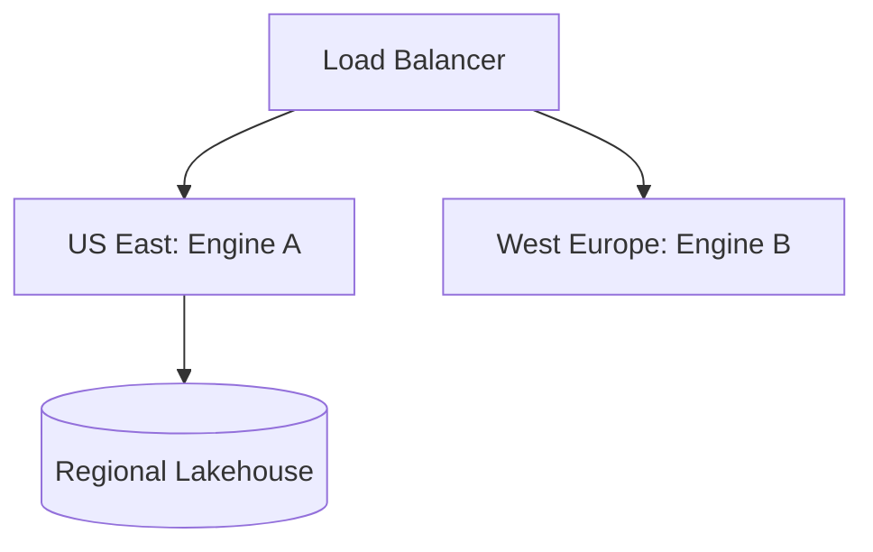

### 7. DR Failover Model
Ensuring quality monitoring is resilient to regional outages.

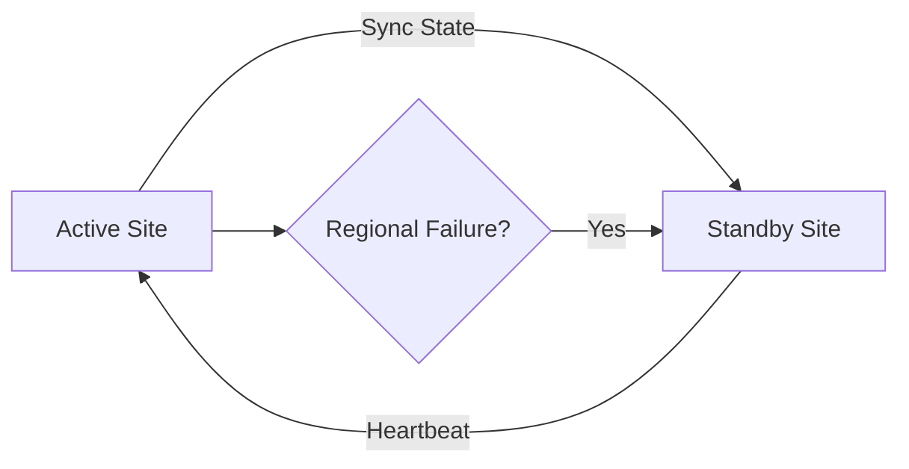

### 8. API Gateway Architecture
Securing and throttling the entry point for quality orchestration.

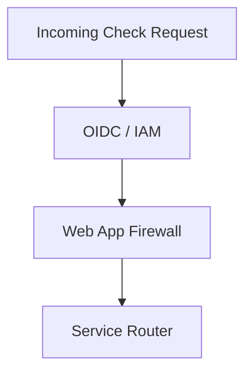

### 9. Queue Worker Architecture
Managing long-running profiling and scoring tasks at scale.

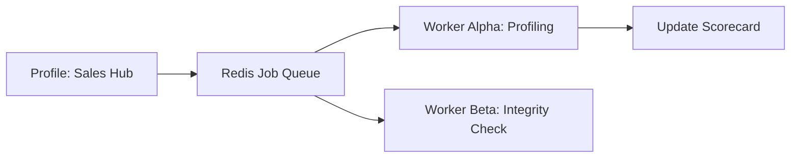

### 10. Dashboard Analytics Flow
How raw quality telemetry becomes executive trust scorecards.

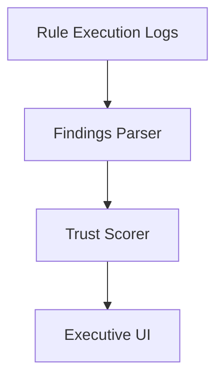

### 11. Profiling Workflow
Automatically discovering the "Shape" of data.

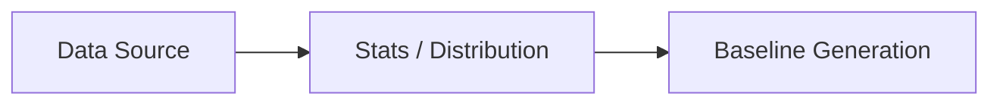

### 12. Completeness Check Model
Ensuring no data is missing.

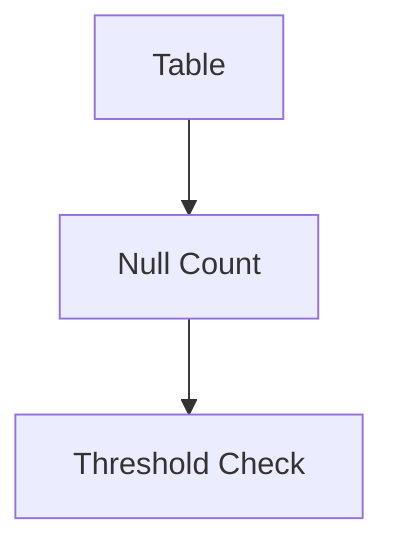

### 13. Accuracy Validation Flow
Verifying values against business logic.

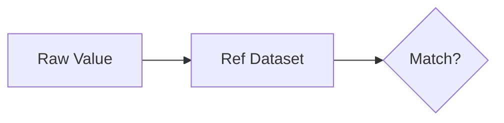

### 14. Consistency Rules Workflow
Synchronizing data across systems.

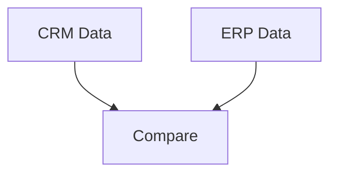

### 15. Uniqueness Detection Model
Eliminating duplicate records.

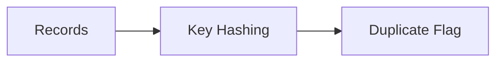

### 16. Referential Integrity Flow
Ensuring relationships are unbroken.

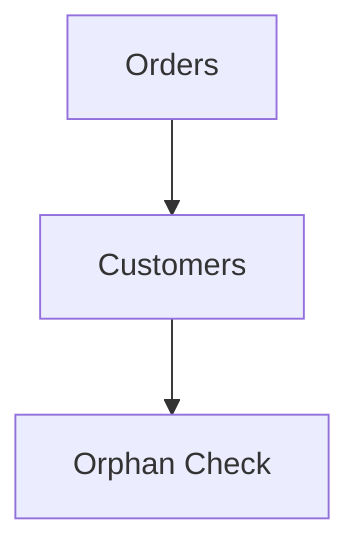

### 17. Freshness SLA Evaluation
Monitoring the "Heartbeat" of data.

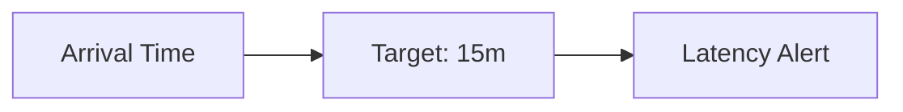

### 18. Schema Drift Detection
Protecting against breaking structure changes.

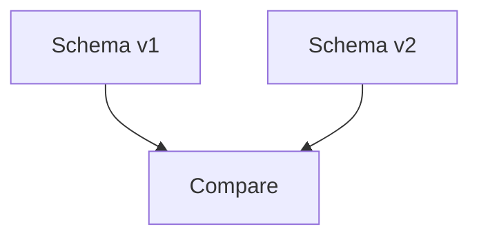

### 19. Trust Score Calculation
The unified metric for data reliability.

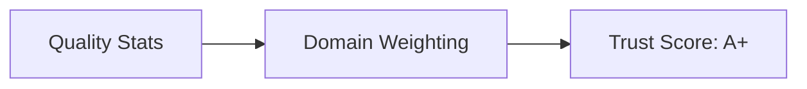

### 20. Rule Severity Model
Prioritizing critical failures.

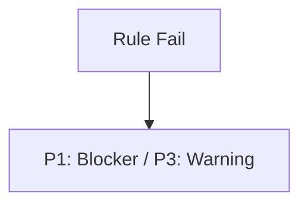

### 21. Incident Triage Workflow
Managing quality failures efficiently.

```mermaid
graph LR
    Alert[Failure] --> Triage[Steward Review]
```

### 22. Root Cause Analysis Model
Finding the source of the "Pollution."

```mermaid
graph TD
    Out[Impact] --> Trace[Lineage Trace]
    Trace --> Root[Source Bug]
```

### 23. Ticket Creation Lifecycle
Integrating quality into the dev workflow.

```mermaid
graph LR
    Alert[Failure] --> Jira[Create Ticket]
```

### 24. Steward Assignment Flow
Enforcing accountability for data domains.

```mermaid
graph TD
    Data[Sales Data] --> Steward[John Doe: Sales Steward]
```

### 25. Waiver Exception Workflow
Managing legitimate data variances.

```mermaid
graph LR
    Req[Exception Req] --> Board[Governance Review]
```

### 26. Retry / Replay Pipeline
Recovering from transient failures.

```mermaid
graph TD
    Fail[Job Fail] --> Backoff[Exponential Backoff]
```

### 27. Correction Backfill Model
Healing historical data errors.

```mermaid
graph LR
    Fix[Bug Fix] --> Replay[Process Old Data]
```

### 28. Producer-consumer Feedback Loop
Aligning data expectations.

```mermaid
graph TD
    Cons[Consumer] --> Feedback[Quality Feedback]
    Feedback --> Prod[Producer]
```

### 29. SLA Breach Escalation
Reporting critical delays to management.

```mermaid
graph LR
    Breach[SLA Breach] --> Pager[Executive On-Call]
```

### 30. Continuous Improvement Cycle
Moving from "Reactive" to "Proactive" quality.

```mermaid
graph TD
    Analyze[Metrics] --> Improve[Rule Tuning]
```

### 31. Snowflake Quality Checks
Integrating with the Snowflake engine.

```mermaid
graph LR
    SF[Snowflake] --> SQL[Quality SQL]
```

### 32. Databricks Quality Flow
Lakehouse monitoring via Spark.

```mermaid
graph TD
    DBX[Databricks] --> Spark[Spark DQ Job]
```

### 33. Fabric Quality Workflow
SaaS data monitoring on Microsoft Fabric.

```mermaid
graph LR
    Fab[Fabric] --> Lake[OneLake Check]
```

### 34. BigQuery Rule Execution
GCP native quality monitoring.

```mermaid
graph TD
    BQ[BigQuery] --> BQ_Job[BQ Audit Job]
```

### 35. Redshift Monitoring Model
AWS data warehouse audits.

```mermaid
graph LR
    RS[Redshift] --> Audit[Audit View]
```

### 36. SQL Database Checks
Monitoring legacy and operational stores.

```mermaid
graph TD
    SQL[PostgreSQL] --> Rules[Check Rules]
```

### 37. API Payload Validation
Ensuring interface contracts are met.

```mermaid
graph LR
    Req[JSON Req] --> Schema[JSON Schema]
```

### 38. Kafka Stream Quality Model
Real-time quality on the fly.

```mermaid
graph TD
    Stream[Kafka] --> KSQL[KSQL Validation]
```

### 39. dbt Test Integration
Synergy between modeling and quality.

```mermaid
graph LR
    dbt[dbt tests] --> Hub[Quality Portal]
```

### 40. Batch Scheduler Lifecycle
Managing periodic quality audits.

```mermaid
graph TD
    Timer[Cron] --> Job[Trigger DQ]
```

### 41. Executive KPI Review Cycle
Reporting trust scores to the CDO.

```mermaid
graph LR
    Stats[Stats] --> Deck[Executive Deck]
```

### 42. Domain Scorecard Model
Benchmarking departments against each other.

```mermaid
graph TD
    Fin[Finance] --> Bench[Benchmark]
    HR[HR] --> Bench
```

### 43. Product Owner Accountability
Ensuring product owners care about data.

```mermaid
graph LR
    Score[D Grade] --> Alert[Product Owner]
```

### 44. Trusted Dataset Certification
The "Gold Star" for data consumers.

```mermaid
graph TD
    DQ[Pass DQ] --> Cert[Certified Trusted]
```

### 45. Consumer Satisfaction Loop
Measuring how users perceive data quality.

```mermaid
graph LR
    User[User] --> Survey[Rating: 4.5/5]
```

### 46. Cost of Poor Quality Model
Quantifying the financial impact of errors.

```mermaid
graph TD
    Errors[Data Errors] --> Costs[$1.2M Loss]
```

### 47. Adoption Maturity Roadmap
The journey to industrialized data trust.

```mermaid
graph LR
    P1[Reactive] --> P2[Managed]
```

### 48. Quarterly Governance Review
Aligning quality strategy with business.

```mermaid
graph TD
    Review[Review Meeting] --> Plan[Next Quarter]
```

### 49. Benchmark Comparison Model
Comparing performance against industry peers.

```mermaid
graph LR
    Org[Our Org] --> Peers[Industry Avg]
```

### 50. Board Reporting Workflow
Presenting the state of data to the board.

```mermaid
graph TD
    Metrics[Reliability] --> Board[Board Presentation]
```

### 51. OIDC / SSO Auth Flow
Secure portal access.

```mermaid
graph LR
    User[User] --> Okta[Okta / IDP]
```

### 52. RBAC / ABAC Model
Governing who can define rules.

```mermaid
graph TD
    Role[DQ Architect] --> Perm[Write Rules]
```

### 53. Secrets Management Flow
Securing data source credentials.

```mermaid
graph LR
    App[Engine] --> Vault[Vault / KV]
```

### 54. Audit Logging Architecture
Tracking every rule change.

```mermaid
graph TD
    Change[Edit Rule] --> Log[(Audit Log)]
```

### 55. Metrics Pipeline
Monitoring the performance of the DQ stack.

```mermaid
graph LR
    Engine[Engine] --> Prom[Prometheus]
```

### 56. Logging Architecture
Centralized engine records.

```mermaid
graph TD
    Pod[DQ Pod] --> Loki[Loki]
```

### 57. Tracing Model
Tracing quality requests across services.

```mermaid
graph LR
    Portal[UI] --> Trace[OTel Trace]
```

### 58. Release Pipeline Workflow
Continuous delivery of the framework.

```mermaid
graph TD
    Git[Code] --> GHA[Deploy]
```

### 59. Canary Validation Flow
Testing new rules on a subset of data.

```mermaid
graph LR
    Rule[New Rule] --> Canary[1% Sample]
```

### 60. Change Governance Workflow
Governing updates to critical quality rules.

```mermaid
graph TD
    Edit[Edit P1 Rule] --> Appr[CAB Approval]
```

---

## 🔬 Data Quality Framework Methodology

### 1. The Six Dimensions of Quality
Our framework is built on an industry-standard methodology:
- **Completeness**: Are there missing values or records?
- **Accuracy**: Does the data reflect the real-world truth?
- **Consistency**: Is the data uniform across all systems?
- **Validity**: Does the data follow the defined business rules/formats?
- **Uniqueness**: Are there redundant records?
- **Freshness**: Is the data available when needed?

### 2. Operating Cadence
Data trust is not a one-time project; it is an ongoing operational commitment:
1. **Daily**: Automated rule execution and incident alerting.
2. **Weekly**: Steward review of quality regressions and MTTR.
3. **Monthly**: Domain-level scorecard reviews with product owners.
4. **Quarterly**: Strategic alignment of quality targets with business OKRs.

---

## 🚦 Getting Started

### 1. Prerequisites
- **Python 3.11+**.
- **Terraform** (v1.5+).
- **Docker Desktop**.

### 2. Local Setup
```bash
# Clone the repository
git clone https://github.com/Devopstrio/data-quality-framework.git
cd data-quality-framework

# Start the Quality Control Plane
docker-compose up --build
```
Access the Quality Portal at `http://localhost:3000`.

---

## 🛡️ Governance & Security
- **Security-by-Design**: All data source credentials are encrypted and stored in hardware security modules (HSM) or cloud-native vaults.
- **Embedded Auditability**: Every rule change, execution, and override is recorded in an immutable audit log.
- **Least-Privilege Access**: Role-based access control (RBAC) ensures only authorized stewards can define or modify critical quality rules.

---
<sub>&copy; 2026 Devopstrio &mdash; Engineering the Future of Industrialized Data Trust.</sub>
