<div align="center">


<h1>Data Quality Framework</h1>

<p><strong>The Institutional-Grade Platform for Standardized Data Trust, Validation Engineering, and Multi-Cloud Quality Governance Ecosystems.</strong></p>

[]()
[]()
[]()

<br/>

> **"Industrializing data validation to automate enterprise trust."** 
> **Data Quality Framework** is an enterprise-grade solution designed to provide a secure, measurable, and highly automated foundation for global data quality operations. It orchestrates the complex lifecycle of data trust—from continuous schema profiling and rule execution to anomaly detection and unified certification auditing.

</div>

---

## 🏛️ Executive Summary

Fragmented validation scripts and manual data wrangling are strategic operational liabilities; lack of centralized quality orchestration is a primary barrier to organizational AI readiness and executive decision-making. Organizations fail to trust their data not because of a lack of storage, but because of fragmented rule standards, lack of automated anomaly validation, and an inability to orchestrate quality planes with industrial precision.

This repository provides the **Quality Intelligence Plane**. It implements a complete **Validation-Framework-as-Code**, enabling Data Governance and Platform Engineering teams to manage global trust foundations as first-class citizens. By automating the identification of accuracy bottlenecks through real-time telemetry analysis and orchestrating the provisioning of secure performance-driven validation policies, we ensure that every organizational data asset—from raw Bronze tables to certified Gold models—is validated by default, audited for history, and strictly aligned with institutional SLA frameworks.

---

## 📐 Architecture Storytelling: Principal Reference Models

### 1. Principal Architecture: Global Data Quality & Trust Intelligence Plane
This diagram illustrates the end-to-end flow from data ingestion and multi-cloud orchestration to rule enforcement, anomaly validation, and institutional certification auditing.

```mermaid
graph LR
    %% Subgraph Definitions
    subgraph DataIngress["Raw Estate & Pipeline Ingress"]
        direction TB
        Raw_Storage["S3 / ADLS / GCS (Bronze)"]
        Stream_Ingest["Kafka / Event Hubs"]
        Transact_DBs["Operational SQL / NoSQL"]
    end

    subgraph IntelligenceEngine["Quality Intelligence Hub"]
        direction TB
        API["FastAPI Validation Gateway"]
        QualityOrchestrator["Global Rule & Profiling Hub"]
        Governance_Hub["Compliance & Certification Guardrail Hub"]
        AIOps_Validator["Drift & Anomaly Analysis Hub"]
    end

    subgraph OperationsPlane["Distributed Validation Ecosystem"]
        direction TB
        ManagedEngines["Managed Standardized Rule Executors"]
        ActiveProfiles["Managed Automated Data Profilers"]
        CertifiedSinks["Managed Trusted Consumption Hubs"]
    end

    subgraph OperationsHub["Institutional Quality Hub"]
        direction TB
        Scorecard["Data Trust Maturity Scorecard"]
        Analytics["Anomaly MTTR & Certification Velocity Stats"]
        Audit["Forensic Validation Metadata Lake"]
    end

    subgraph DevOps["Quality-Framework-as-Code Framework"]
        direction TB
        TF["Terraform Engine Modules"]
        DriftBot["Rule & Config Drift Validator"]
        ChatOps["Trust Operations Hub"]
    end

    %% Flow Arrows
    DataIngress -->|1. Register Schema| API
    API -->|2. Orchestrate Profile| QualityOrchestrator
    QualityOrchestrator -->|3. Apply Trust Guard| Governance_Hub
    Governance_Hub -->|4. Assess Anomaly| AIOps_Validator
    
    AIOps_Validator -->|5. Execute Rule| OperationsPlane
    OperationsPlane -->|6. Notify Status| ChatOps
    API -->|7. Visualize Health| Scorecard
    
    Scorecard -->|8. Track Maturity| Analytics
    Scorecard -->|9. Record Validation| Audit
    
    TF -->|10. Provision Backbone| IntelligenceEngine
    DriftBot -->|11. Inject Accuracy Risk| QualityOrchestrator
    Audit -->|12. Improve Operations| ManagedEngines

    %% Styling
    classDef ingress fill:#f5f5f5,stroke:#616161,stroke-width:2px;
    classDef intel fill:#e8eaf6,stroke:#1a237e,stroke-width:2px;
    classDef operations fill:#e1f5fe,stroke:#01579b,stroke-width:2px;
    classDef ops fill:#ede7f6,stroke:#311b92,stroke-width:2px;
    classDef devops fill:#e8f5e9,stroke:#1b5e20,stroke-width:2px;

    class DataIngress ingress;
    class IntelligenceEngine intel;
    class OperationsPlane operations;
    class OperationsHub ops;
    class DevOps devops;
```

### 2. The Quality Validation Lifecycle Flow
The continuous path of a validation platform from initial ingestion (raw) and profiling (distributions) to active execution (rules), scoring (trust), and institutional forensic auditing (certification).

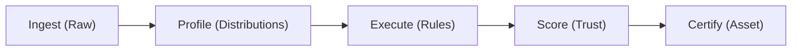

### 3. Distributed Quality Topology
Strategically orchestrating standardized validation engines across operational databases, global data lakehouses, and multi-cloud analytics hubs, providing a unified institutional view of global data trust.

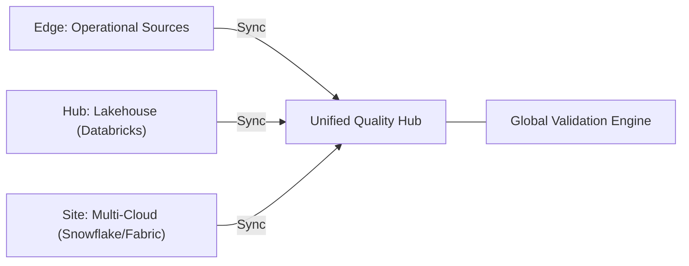

### 4. Quality Governance & High-Trust Data Plane Protection Flow
Executing complex logic for securing the bridge between raw landing zones, quality validation gates, and certified consumption layers, ensuring every organizational identity is verified and every data access is according to institutional standards.

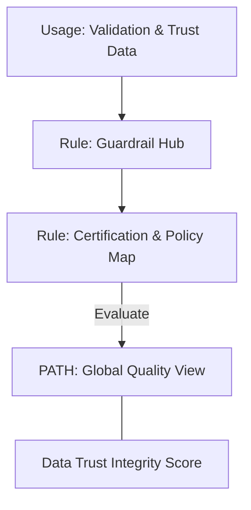

### 5. Multi-Cloud Data Quality Federation Flow
Automatically managing unified real-time validation standards across Azure Fabric, AWS Redshift, Databricks, and Snowflake, ensuring institutional quality consistency and trust boundaries by default.

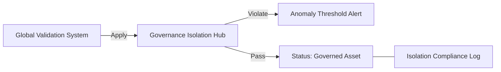

### 6. Encryption & Perimeter Protection Flow (Quality Standard)
Managing the lifecycle of a profiling request, automatically enforcing institutional TLS 1.3, Data-in-Use masking, and row-level security standards as required by security policy, ensuring zero-latency security confidence during validation.

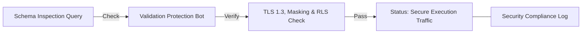

### 7. Institutional Quality Maturity Scorecard
Grading organizational performance based on key indicators: Rule Coverage, Incident MTTR (Mean Time to Resolve), and Certified Asset Usage.

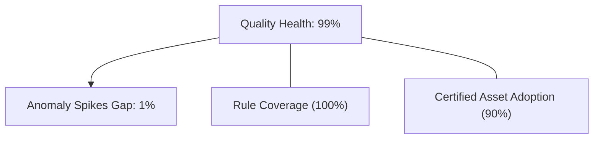

### 8. Identity & RBAC for Quality Governance
Managing fine-grained access to validation hubs, rule provisioning, and audit logs between Data Stewards, Data Engineers, and Governance Leads.

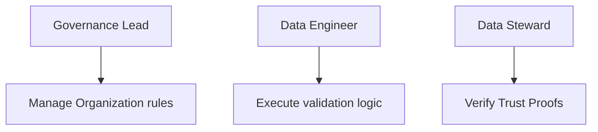

### 9. IaC Deployment: Quality-Framework-as-Code Framework
Using modular Terraform to deploy and manage the versioned distribution of the trust tracking hubs, policy protection workers, and forensic metadata lakes.

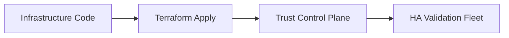

### 10. AIOps Quality Drift & Risk Validation Flow
Using advanced analytics to identify sudden surges in anomaly detection, schema drift errors, suspicious freshness SLA breaches, or unusual data shape changes that could result in institutional risk or broken AI models.

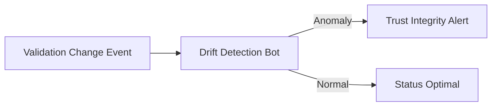

### 11. Metadata Lake for Forensic Quality Audit
Storing long-term records of every rule executed (metadata), every anomaly detected, and every remediation history for institutional record-keeping, compliance auditing, and post-provisioning forensics.

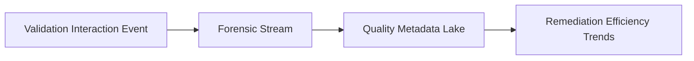

---

## 🏛️ Core Governance Pillars

1.  **Unified Foundation Coordination**: Maximizing accuracy by centralizing all validation workflows through a single institutional plane.
2.  **Automated Rule Provisioning**: Eliminating "manual data cleaning" scenarios through proactive orchestration and pattern verification.
3.  **Sequential Trust Intelligence**: Ensuring zero-interruption operations through dependency-aware certification-driven platform engineering.
4.  **Zero-Trust Validation Protection**: Automatically enforcing identity-based access and data masking evaluation across all profiling tiers.
5.  **Autonomous Operations Logic**: Guaranteeing reliability through automated industry-specific anomaly monitoring runbooks.
6.  **Full Quality Auditability**: Immutable recording of every schema drift, null check, and freshness breach for institutional forensics.

---

## 🛠️ Technical Stack & Implementation

### Quality Engine & APIs
*   **Framework**: Python 3.11+ / FastAPI.
*   **Performance Engine**: Custom Python-based logic (Pandas/PySpark) for multi-cloud rule execution and trust scoring metrics.
*   **Integrations**: Native connectors for Great Expectations, dbt tests, Databricks, Snowflake, and Microsoft Purview.
*   **Persistence**: PostgreSQL (Quality Ledger) and Redis (Live Validation State).
*   **Auth Orchestrator**: Federated OIDC/SAML for least-privilege trust management access.

### Governance Dashboard (UI)
*   **Framework**: React 18 / Vite.
*   **Theme**: Dark, Slate, Indigo (Modern high-fidelity trust aesthetic).
*   **Visualization**: D3.js for schema topologies and Recharts for validation velocity analytics.

### Infrastructure & DevOps
*   **Runtime**: AWS EKS or Azure Kubernetes Service (AKS) for management plane.
*   **Quality Hub**: Managed event sourcing for immutable certification timeline reconstruction.
*   **IaC**: Modular Terraform for deploying the validation landing zone and scoring fleet.

---

## 🏗️ IaC Mapping (Module Structure)

| Module | Purpose | Real Services |
| :--- | :--- | :--- |
| **`infrastructure/quality_hub`** | Central management plane | EKS, PostgreSQL, Redis |
| **`infrastructure/validation_workers`** | Distributed automation workers | Azure, AWS, GCP APIs |
| **`infrastructure/profiling_pipes`** | Quality Orchestration Hubs | Webhooks, Spark/Databricks |
| **`infrastructure/auditing`** | Forensic certification sinks | S3, Athena, Quicksight |

---

## 🚀 Deployment Guide

### Local Principal Environment
```bash
# Clone the Data Quality Framework repository
git clone https://github.com/devopstrio/data-quality-framework.git
cd data-quality-framework

# Configure environment
cp .env.example .env

# Launch the Quality stack
make init

# Trigger a mock validation request and automated guardrail execution simulation
make simulate-quality
```

Access the Management Portal at `http://localhost:3000`.

---

## 📜 License
Distributed under the MIT License. See `LICENSE` for more information.

---
<div align="center">
  <p>© 2026 Devopstrio. All rights reserved.</p>
</div>
